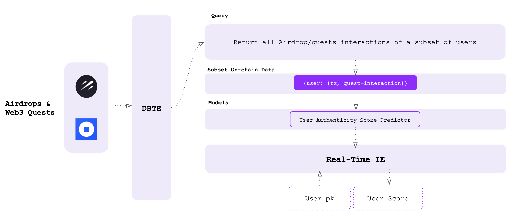

# Overview

### Data Layer

How we use the Seshat base layer to create the mini dataset of (user, quest/airdrop) interaction pairs

### Model Layer

How we use Seshat base layer to upload the predictive model to calculate the eligibility/authenticity for each (user, quest/airdrop) pairs