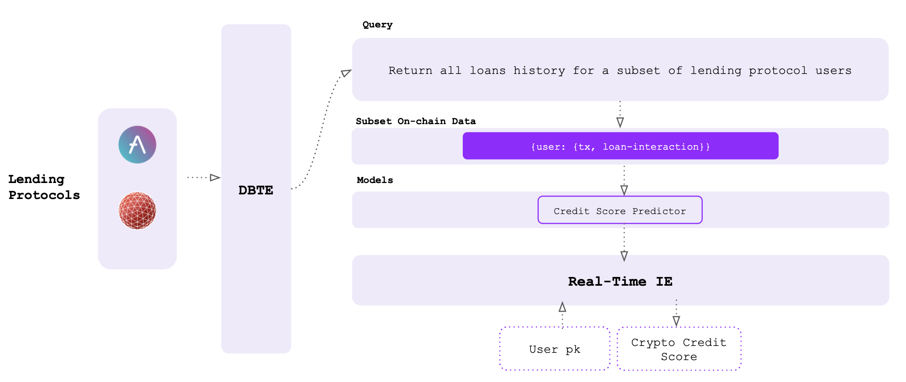

# Overview

### Data Layer

How we use the Seshat base layer to create the mini dataset of (user, loan-interactions) pairs

### Model Layer

How we use Seshat base layer to upload the predictive model to calculate the crypto credit score for each public key