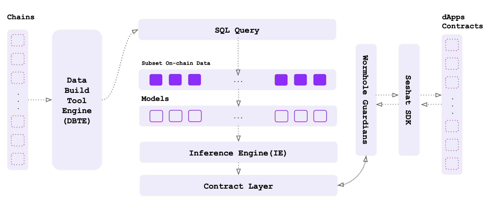

# Seshat Base Layer


**Seshat**, Bring Predictive Features to the Web3 Infrastructure



Explain each module in the main architecture:
- On-chain Data
  - Ingestion: The layer handling ingesting on-chain data into the Seshat data wearhouse.
  - Transformation (DBTE): The layer responsible for creating reusable tables on top of raw_data ingested by ingestors.
- Query Layer
  - Mini Dataset (Training): The module responsible for creating query runIds constructing datasets which can be fetched upon run status finishes.
  - Inference Data: Similar to dataset layer but providing low latency data into the activated models.
- Models
  - Training: Same as dataset layer, providing large amount of data for training (higher latency since it will be created just once reusable by others).
  - Inference Engine (Real time): The engine responsible for running models on inference mode if the model is activated upon receiving new requests.
- Integration.
  - Contract Layer: The layer getting requests on-chain and provding results to Wormhole gaurdians to be propagated on destination chain (i.e., the chain request initiated).
  - Wormhole Integration: The connection between Seshat gateways and wormhole gateways.
  - Seshat SDK: The Node.JS SDK providing main functionalities (Data, Model, Inference layers) by simple importable methods to be used directly from dApp front-ends.

## Seshat CLI (dApp Front-end)

First you need to install Seshat-SDK (Node.JS):

`npm install seshat`

### Mini Dataset Layer

To create your dataset, you need to create a run-id by providing your PSQL query, then fetching the result by calling the created run-id for your query. You can see an example to retrieve balances of a subset of users:

```javascript
const seshat = require('seshat');
const QUERY = ''' SELECT * FROM ethereum_raw_decoded WHERE to_address_type = "contract" AND transaction_date >= current_date - interval "6 months"; ''';
const API_KEY = "<your api key here>";

const datasetId = await seshat.create_datasetRunId(QUERY, API_KEY)
console.log(`Dataset run created with ID: ${datasetRunId}`);

const pollingInterval = 1 * 1000;
const start = Date.now();
const timeout = 10 * 60 * 1000; // 10min timeout

const getexecuteStatus = async () => {
  const executeStatus = await seshat.get_datasetRunId_status(datasetRunId)

  if (!["created", "queued", "running"].includes(executeStatus)) {
    return executeStatus;
  }
  console.log(`Current status: ${executeStatus}. Waiting ${pollingInterval}s...`);
  if (Date.now() < start + timeout) {
    setTimeout(getexecuteStatus, pollingInterval);
  }
};
executeStatus = getexecuteStatus();

if (executeStatus == "success") {
  const results = seshat.fetch_datasetRunId_results(datasetRunId)

  console.log(
    `Dataset returned ${results["data"].length} rows, with fields: ${results[
      "meta"
    ]["columns"]
      .map((c) => c.get("name"))
      .join(", ")}`
  );
} else if (runStatus == "failed") {

  console.log(`Dataset failed with error: ${results["error]}`
} else {
  console.log(`Dataset run finished with status: ${runStatus}. No results.`);
}
```

For instance in above Javascript code, we first create a runId for the dataset of transactions where the to_address type is contract (as oppose to users) within past six months. Subsequently, we check the status of running required queries to create such dataset and finally getting the result (i.e., dataset).


### Model Build Layer

Considering the dataset creation from the previous step, the model creation and training phase will be handeled off-chain and the output of your trained model can be pushed to Seshat model hub as follows:

```javascript
  const seshat = require('seshat');
  const API_KEY = "<your api key here>";
  const MODEL_PATH = "<path to your saved PyTorch model>";
  const MODEL_NAME = "<your model name>";
  const MODEL_VERSION = "<model version>";

  // Step 1: Tagging and pushing the model to Seshat model hub
  const pushModelToHub = async () => {
    try {
      const modelId = await seshat.tag_and_push_model(MODEL_PATH, MODEL_NAME, MODEL_VERSION, API_KEY);
      console.log(`Model pushed successfully. Model ID: ${modelId}`);
      return modelId;
    } catch (error) {
      console.error(`Error pushing model to Seshat model hub: ${error}`);
    }
  };

  // Step 2: Activating the model
  const activateModel = async (modelId: string) => {
    try {
      const activationStatus = await seshat.activate_model(modelId, API_KEY);
      if (activationStatus === 'activated') {
        console.log(`Model activated successfully.`);
      } else {
        console.log(`Model activation status: ${activationStatus}`);
      }
    } catch (error) {
      console.error(`Error activating model: ${error}`);
    }
  };

  const main = async () => {
    const modelId = await pushModelToHub();
    if (modelId) {
      await activateModel(modelId);
    }
  };

  main();
```

### Model Inference Layer

Considering the modelId after pushing and activating model on Seshat, you can easily provide the required inputs as payload and get the result executed by running the model on inference mode as follows:

```javascript
const axios = require('axios').default;
const seshat = require('seshat');
const API_KEY = "<your api key here>";
const MODEL_ID = "<your model id>"; 
const INPUT_DATA = { /* your input data */ };

const runInference = async () => {
  try {
    // Start the inference
    const inferenceId = await seshat.run_model_inference(API_KEY, MODEL_ID, INPUT_DATA);
    console.log(`Inference run started. ID: ${inferenceId}`);

    // Poll for inference status
    const checkInferenceStatus = async () => {
      const status = await seshat.get_inference_status(API_KEY, inferenceId);
      if (status === 'success') {
        // Fetch and log results if inference is successful
        const results = await seshat.fetch_inference_results(API_KEY, inferenceId);
        console.log(`Inference returned results: ${JSON.stringify(results)}`);
      } else if (status === 'failed') {
        console.error(`Inference failed.`);
      } else {
        console.log(`Inference status: ${status}. Waiting before next check...`);
        setTimeout(checkInferenceStatus, 1000); // Check again after a delay
      }
    };

    await checkInferenceStatus();
  } catch (error) {
    console.error(`Error during model inference: ${error}`);
  }
};

runInference();
```

## Seshat Contract
Considering your source chain, you need to import Seshat contract into your contract. Other steps (creating dataset, training models, and pushing to Seshat model hub is the same as Seshat CLI above). For instance on EVM chains:

```c
  // SPDX-License-Identifier: MIT
  pragma solidity ^0.8.0;

  import "./Seshat.sol";

  contract MyContract is Seshat {
      // Event to emit the result
      event ResultReceived(string result);

      // Function to send model_id and data payload
      function sendRequest(uint model_id, string memory data) public {

          string memory result = processRequest(model_id, data);

          emit ResultReceived(result);
    }
}
```