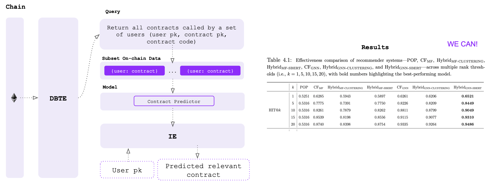
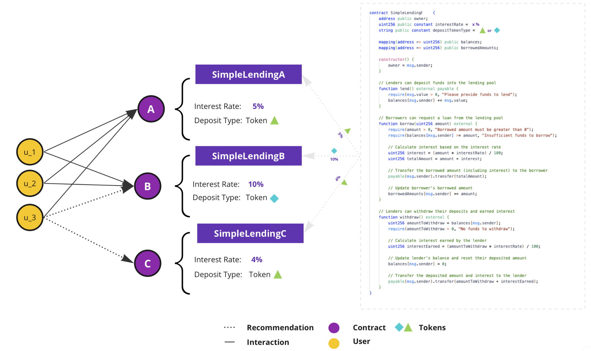
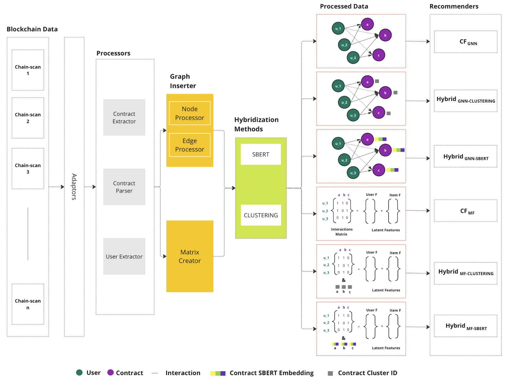
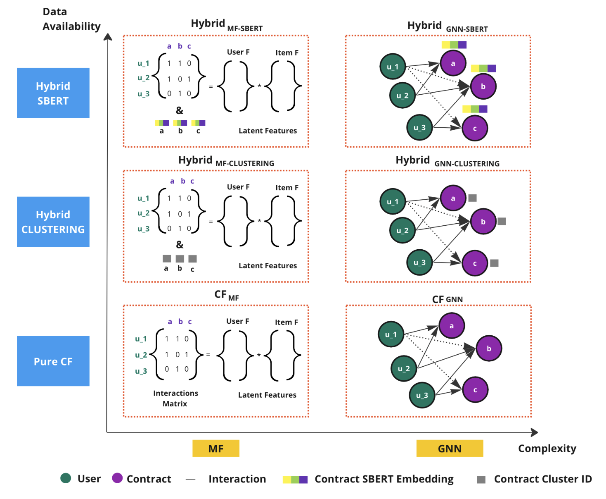
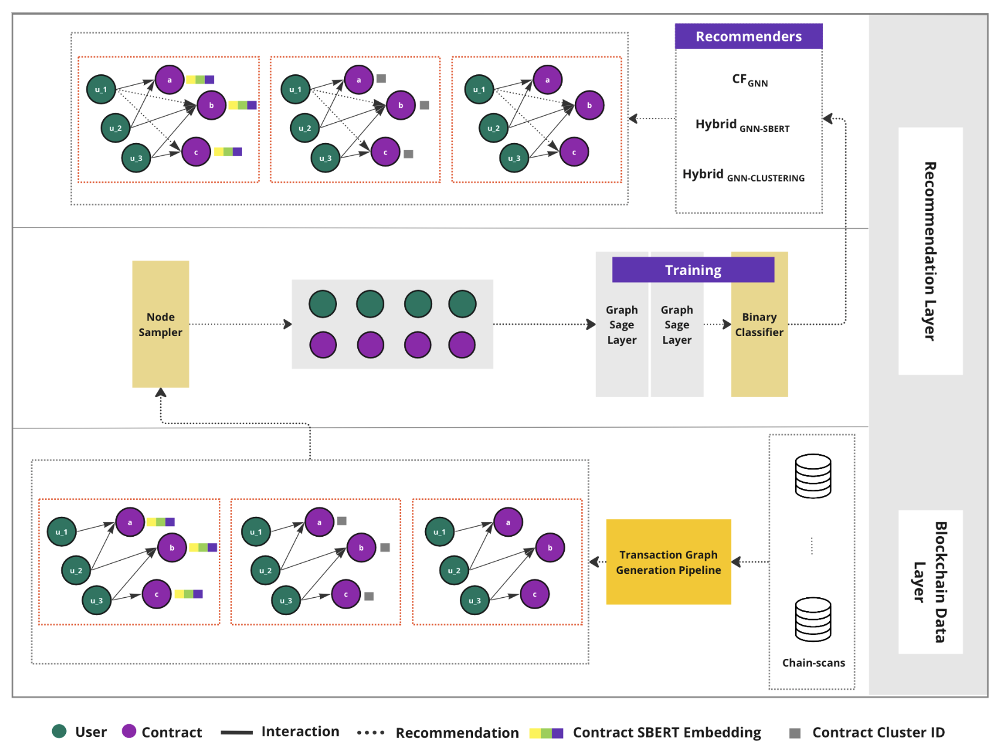
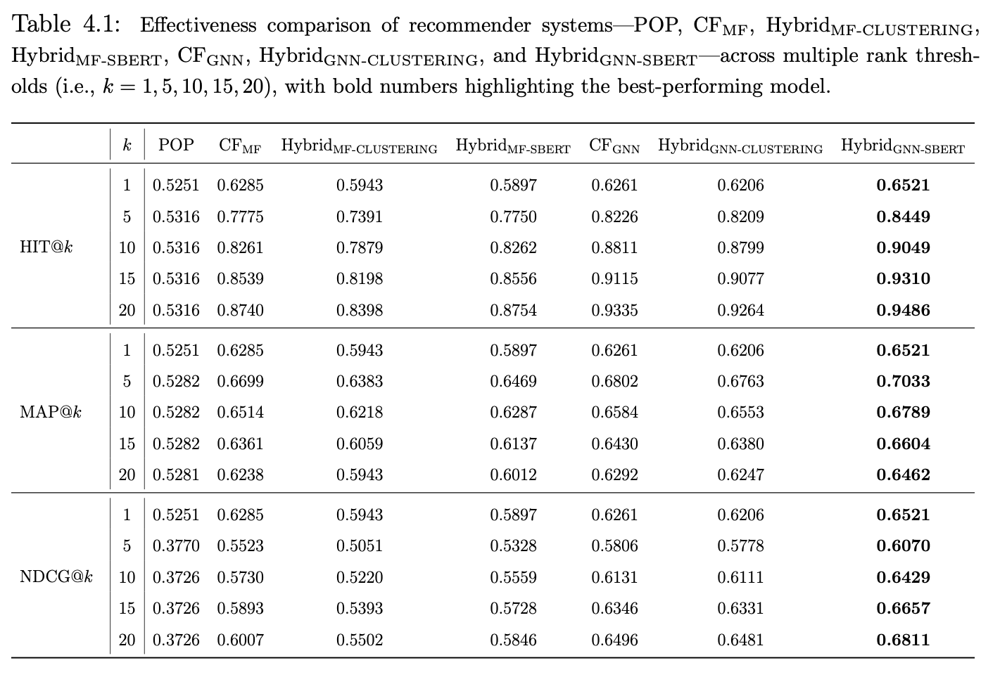

# Web3 Foundation RecSys

### Usage and CLI

If you are a dApp developer, and wanna to rank or rerank a list of custom contents, you can easily use Seshat JS SDK to run a pre-defined ranker (a content-based ranker works based on the cosine similarity of each item in the provided array, and the context of contracts the provided public key/user run before):
- Create API key: DApp developers should first create an account on Seshatlabs.xyz. They can either connect their blockchain wallet or use Login with Google. Then, they should go to their profile to obtain their API key. Remember that there is a cap limit for some endpoints in the free tier.

- Ranker: Next, install the Seshat SDK with:

  `npm install seshat`

  Here's a simple example of how to rerank items based on a user's address to deliver a personalized experience:

  ```javascript
  // Import the seshat package
  const seshat = require('seshat');

  // Set your API key
  const apiKey = 'your-api-key';

  // Task 2: Get rerank of a list of items based on user address
  const itemList = [
    {title: 'Item 1', description: 'This is the first item'},
    {title: 'Item 2', description: 'This is the second item'},
    {title: 'Item 3', description: 'This is the third item'}
  ];
  const rerankResult = await seshat.getRerank(apiKey, itemList, userAddress);
  console.log(rerankResult);
  ```

By following these steps, you can easily integrate Seshat's Web3 personalization engine into your dApp, providing a customized and targeted experience for your users. We are working to extend the model supports of ranker method which enables you to provide your own ranker instead of using the pre-defined one.

Let's deep dive into one of cool experiemnts we run with Seshat base layer:



Here we cover how we used the Seshat base layer to create the mini dataset of (user, txs) interaction pairs, designed the predictive models to rank any array of content for a selected user public key based on transactional data, and providing the results discussing ** whether on-chain data has any sort of prediction power or not ** (you can find more detail [here](https://uwspace.uwaterloo.ca/bitstream/handle/10012/20178/Khatiri_Sean.pdf?sequence=3&isAllowed=y)).

### Data

First of all, let's see an example where a recommender system can provide relevant items (i.e., contracts) based on user's previous transactions (i.e., contracts the user run before):



Now that we have a basic understanding of where a RecSys based on on-chain data can help, let's deep dive on an experiment where we want to collect transactions of a subset of user public keys on Ethereum to run a list of predictive models (i.e., RecSys models):



To do so, Seshat ingestor provides the on-chain data (in this experiment just for Ethereum network) for a subset of users. additionally, the user and contract addresses will be divided to provide two sets of addresses: users and contracts. As we know on Ethereum we have two unique addresses: Externally Owned Accounts (EOA) and Contract addresses. Subsequently, following RecSys best practices since on-chain data takes a graph bipartite graph structure, Seshat can transform raw data into a graph-based structure with accounts as nodes and transactions as edges (note: we just consider EOA->contract transactions fro the sake of problem). And finally based on the RecSys models described in next section, additional modules (Matrix Creator, and Hybridization) are added to the Seshat base layer data pipeline.

### Model

we considered the following RecSys models in this experiemnt:



We use clustering similar contracts and pre-trained language models to find similar contracts and help the recommender systems in finding relevant contracts to a user. All these models are pushed to the Seshat model hub using Seshat CLI :

```bash
  Seshat tag <model_name>
  Seshat push <model_name>
```

Here you can find more detail about GNN RecSys architecturs and training process:



All training are performed off-chain and just the final trained model will be pushed to the Seshat model hub.

### Results

Below we can find the metrics supporting how relevant the list of recommended contracts are based on the actual user-contract interactions (in testset):


